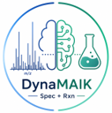

# DynaMAIK

Dynamaik is a PyTorch project for predicting product SMILES and molecular formulas from GC-MS spectra, optionally conditioned on reaction reactants and sum formulas. The current training pipeline supports spectrum encoders, reactant encoders, formula encoders/decoders, fusion encoders, multitask SMILES/formula prediction, and validation-time confidence reporting for SMARTS-defined substructures.

<p align="center">
  
</p>

## Project Structure

```text
src/
  data/
    collate.py          Batch collation and teacher-forcing tensor creation
    loaders.py          Dataset class for spectra, reaction SMILES, products, and formulas
    preprocess.py       Spectrum vectorization, peak extraction, SMILES enumeration helpers
    smarts_filtered.txt SMARTS list for functional group confidence
    tokenizers.py       SMILES and formula tokenizers

  models/
    configs.py          TrainConfig and TransformerConfig dataclasses
    evaluation.py       Validation metrics and generation-based evaluation
    metrics.py          Token/sequence metrics, Tanimoto, substructure stats
    predict.py          Inference CLI for trained checkpoints
    spec2prod.py        Main spectrum/reactant/formula encoder-decoder components
    train.py            Training entry point

  utils/
    model_runtime.py    Shared runtime helpers for memory construction and metrics
    train_runtime.py    Training orchestration helpers
    utils_train.py      Logging, scheduler, chemistry, SMARTS, and formula-count helpers
```

## Main Capabilities

- Spectrum encoding from raw vectors, ordered bins, or top-k 2D peak tensors.
- Product-only or full reaction-sequence decoding.
- Optional reactant encoder.
- Optional formula encoder.
- Optional formula decoder for multitask SMILES plus formula prediction.
- Optional fusion encoder for spectrum/reactant memory fusion.
- Optional count head for element-count auxiliary loss.
- Autoregressive validation prediction logging.
- SMARTS-based substructure confidence reporting.
- Checkpoint-based batch prediction from CSV or Parquet inputs.

## Requirements

The project expects a Python environment with the scientific/ML chemistry stack used in the source code:

Python 3.10+
torch==2.9.0
pandas==2.3.3
numpy==2.2.6
scikit-learn==1.7.2
tqdm==4.67.1
mlflow==3.6.0
rdkit==2025.9.1
PyYAML==6.0.3
pyarrow==22.0.0

## Data Format

Training and prediction use tabular CSV/Parquet data. The default column names are defined in `src/models/configs.py`:

- `SPECTRUM_PREDICTED`: spectrum dictionary stored as a Python-literal string, for example `{43: 0.5, 91: 1.0}`.
- `reaction_smiles`: reaction SMILES, usually `REACTANTS>>PRODUCT`.
- `sum_formula`: product molecular formula, required when formula encoder/decoder paths are enabled.

Important configuration fields in `TrainConfig`:

- `dataset`: training dataset filename.
- `validation_path`: optional external validation CSV path.
- `home_path`: base path used by the current training script.
- `spectrum_column`, `reaction_smiles_column`, `formula_column`: dataframe column names.
- `encoder_mode`: one of `raw`, `binned`, or `binned_2D`.
- `decoder_mode`: `product` or `rxn`.

The current defaults contain local absolute paths. Update `TrainConfig` before running in a new environment.

## Training

Edit `src/models/configs.py` to set dataset paths and model/training options, then run:

```bash
python -m src.models.train
```

Training uses MLflow for run tracking and writes artifacts under the active MLflow artifact directory, including:

- `smiles_tokenizer.json`
- `formula_tokenizer.json`, when formula modeling is enabled
- `checkpoints/best.pt`
- `checkpoints/epoch_XXX.pt`
- `predictions/*.csv`
- final model component weights in `predictions/`

## Prediction

Run inference with a trained checkpoint:

```bash
python -m src.models.predict \
  --input /path/to/input.csv \
  --out /path/to/predictions.csv \
  --ckpt /path/to/artifacts/checkpoints/best.pt
```

Common options:

```bash
python -m src.models.predict \
  --input data.csv \
  --out predictions.csv \
  --ckpt mlruns/.../artifacts/checkpoints/best.pt \
  --artifact_dir mlruns/.../artifacts \
  --spectrum_col SPECTRUM_PREDICTED \
  --reaction_smiles_col reaction_smiles \
  --formula_col sum_formula \
  --batch_size 64 \
  --device cuda \
  --temperature 1.0 \
  --topk 50 \
  --num_samples 10 \
  --rerank_by_frequency
```

The predictor loads tokenizer artifacts from `artifact_dir`. If `artifact_dir` is omitted, it assumes the checkpoint is inside `artifact_dir/checkpoints/`.

## Configuration Notes

Most behavior is controlled by `TrainConfig` in `src/models/configs.py`.

High-impact options:

- `reactant_encoder`: include reactants as an input source.
- `spectrum_encoder`: include spectra as an input source.
- `formula_encoder`: encode formula as model input.
- `formula_decoder`: add formula prediction as a decoder task.
- `train_formula_only`: train only formula prediction.
- `fusion_encoder`: fuse spectrum and reactant representations.
- `multi_source_decoder`: use separate decoder attention over spectrum and reactant memory.
- `topk`, `k_samples`, `temperature`: generation behavior.
- `confidence`, `smarts_path`: SMARTS confidence reporting.

## Development Notes

- `src/utils/model_runtime.py` contains shared runtime helpers used by training and evaluation.
- `src/utils/train_runtime.py` contains training-specific orchestration helpers.
- `src/models/spec2prod.py` contains the main model definitions used by training and prediction.
- Recursive model components require `src.models.tiny_recursive`, which is not currently included. Non-recursive paths import and run without it.

## Verification

Basic repository checks used during refactoring:

```bash
python -m compileall src
python -c "import src.models.train; print('train ok')"
python -c "import src.models.evaluation; print('evaluation ok')"
python -c "import src.utils.model_runtime, src.utils.train_runtime; print('utils ok')"
```

## Known Cleanup Candidates

- Replace absolute paths in `TrainConfig` with CLI/config-file arguments.
- Add a dependency file such as `requirements.txt`, `environment.yml`, or `pyproject.toml`.
- Remove empty placeholder files and generated `__pycache__` directories before publication.
- Decide whether standalone/demo modules such as `src/models/transformer.py` should remain in the published package.
